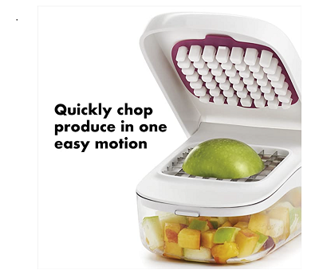
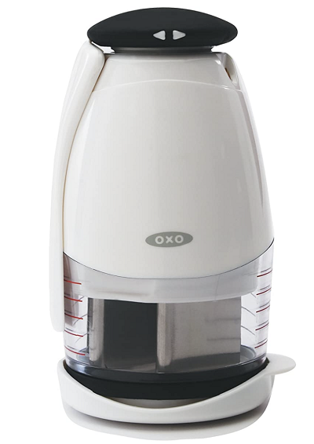
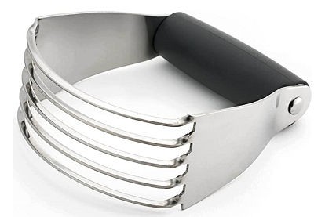
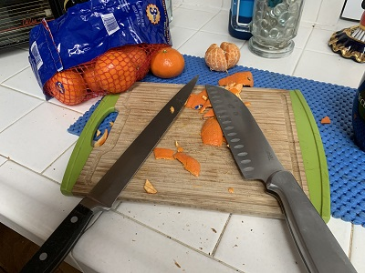
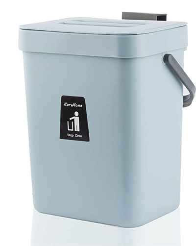

# Meet Chompy

Meet Chompy.  Chompy CRAVES food scraps and cardboard.  YUM YUM!!!!  Done with a meal but there are scraps?  Feed  Chompy.. got cardboard or paper you need to get rid of?  Feed   Chompy..and be delighted by the actions - from chomping noises while it turns scraps into small pieces...to sounds of delight as it enjoys the attention.  Chompy has a friend, Dacomp (not pictured here, but about the size and shape of a big garbage bin like we have in the US where we put our waste for weekly pickup), who survives by taking in Chompy’s broken down food scraps and spinning them into gold!  Well, not the gold we see in jewelry...and not even fools gold, but dark, rich soil that when you use it to grow plants, they will thrive.

 And of course, now that you have grown all these fruits and vegetables....you can eat them...which will leave food scraps....and so the cycle continues

 # BRAINSTORM
 ---

## Requirements
E = Essential
NE = Non-Essential
In priority order

Needs to:
- E chop at least 80% of scraps of vegetables, fruits, cardboard, and paper into small pieces.
- E be safe - not cut or chop any fingers.
- E have a mechanism to start and stop shredding.
- E not jam.
- E take a short amount of time, i.e.: be efficient.
- E easy transfer of chopping to Dacomp.
- E not cause a mess.

- NE not smell.
- NE be easy to clean.
- NE have a mechanism to detect when the container is full and not allow any more food or paper to enter until the container is emptied.
- NE delight the person feeding it so that they want to engage.
- NE not take up too much space.
- NE chop up cardboard and paper into small pieces.

## Separate Out
### Chop up Vegetables and Fruits

#### Mechanisms to accomplish
- Vegetable Chopper
I got to thinking about this after reviewing all other options and thinking about cost/complexity/easy use of each..... 

*See [this Amazon.com item](https://amzn.to/3wqFm0k)*

But instead of person chopping, use gravity and drop the top (weighted or with a spring force) onto the scraps.

*Q: Is using weights "better" than using spring force to release the top piece?*
- Knives
This is my "go to" method for cutting up vegetables and fruit.  So why not use it here?
- Cleavers
When I think of using Cleavers I start laughing at the opportunity to make an arcade game out of it.  The handles of the cleavers are exposed on the sides of Chompy.  We madly slice as the cutting table moves a bit to keep the pieces accessible.  There are holes on the cutting table such that pieces small enough (and any liquid) fall through to the holding container.  How long it takes us to get the scraps into the container is judged based on the weight of the scraps (volume also, etc.?) and time. Every once and awhile, the holding container (Chompy's belly) burps, farts...hmm...

- Scissors
Forget running with scissors, imagine food scraps floating around and we
- Slicer

I just tried this slicer with an orange peel. I was able to get smaller pieces.  However,
- Food processor

I've been using a food processor to break down my veg/fruit waste prior to putting them into a compost bin.  This method is efficient - both from the time it takes and the bits it produces.  However, it is a bit of a pain:
- putting the scraps in - the container is not designed to slop in food waste.  
- the lid gets more difficult to close after scraping out the pieces to take to the compost pile.
- it takes multiple times to get through my daily scraps.
- I'm constantly cleaning the food processor.  Which perhaps for some is therapeutic, but not for me.

- Shredder

This would work great.  My challenge is all those blades and the "precision" positioning make me think building it this way would be challenging and ultimately expensive.  With that said, I am leaping to conclusions on challenge and price since a shredder can be built to shred pretty much anything...concrete may be an exception.

- Claws

I could see using claws to be a lot of fun.  Growling while we tore orange peels, apple cores, and stray lettuce dripping with salad dressing into shreds.  Yet, as I pretend to do this, I feel my claws as pictured wouldn't be able to attach well to things like orange peels and everything would just stick.

- Food Chopper

I forgot about this one. I had a hand vegetable chopper. This type of mechanism might work well.

I did an ["science experiment" video](https://youtu.be/RdokLm71CxA) and found:  
- As a food chopper is currently designed, it won't do well chopping up "tougher" material like citrus peels.
- It is easy to overfill.

- Dough Blender

 

My Mother had one of these...

- Grater

I can imagine a grate tearing scraps to bits by abrasively rubbing against it, but I'm not a fan because using some sort of blade seems far more optimal.

- Garbage Disposal
Garbage disposals are designed to liquify food into a slurry that is then dumped into our sewage system.  We need small bits, not liquid.

### Start and Stop Mechanism
- on/off switch
- lever
- handle

# RESEARCH
---
The chopping mechanism is the overall beast of Chompy.  I started by limiting research to two of the mechanisms I discussed in the brainstorming sections:
- OOH THIS ONE IS COOL This cucumber slicer using a 3d printer...
I was watching a video this AM....
and check the way ...cucumber sits on a rack with spacing for the plastic "knife".  Knife comes down, slices, then pushes over to a pile...it is just fun to watch.  Begs the question is this about fun or efficiency.  Well, if it is all about the video, then all about fun...

I **really** like how plastic is being used...and its just the force slicing it..but then there are things like orange peels that would be harder..still...

- knives, cleavers (I see going from a knife to cleaver as a gradation?)...I'll be using the term "cutters" to refer to this mechanism.
- food processor

Over the past few days, I have been on long drives working through family matters.  While I was not able to go to Home Depot or get to a garage/work space full of material to explore with, I was able to watch videos that could best represent experiments around questions I had:
- **will knives work?**  How would that work with waste versus when "chopping" for cooking?  

After watching a few videos where folks were explaining methods for cutting up vegetables, I began to realize:
    - the motion of cutting vegetables into bits isn't as much fun as I had hoped.  I was hoping for more of a monster chop-chop where the blades would slam down on a cutting board. Vegetables/fruits can be goopy...cooks slide/roll the knife.  In addition, the blades need to be very sharp.  This causes the knives to be fragile. Another ding on using knives.
- **can the bits flung out by the food processor get into the waste container?**  The challenge with the food processor is the bits are flung to the outer sides of the wall of the surrounding container.  This is hard to clean.

...Today I thought about the dough blender and food chopper....

I use a food processor, so I feel I have experimented quite a bit with this option.
# DESIGN
I'm breaking options into three designs:
- Plastic Slicing - similar to  [the cucumber slicer in this video](https://youtu.be/FZnTdPuAecs?t=54)
*Note: Video is the design diagram*
- Arcade Slicing - 
- Shredding - similar to [the Green Cycler](https://www.youtube.com/watch?v=rDH--O7dPuo)
*Note: Video is design diagram...also - I never heard of it, 7 years ago - bad timing or bad product or both?*
# PROTOTYPE
At this point, I'd like to prototype these methods for chopping:
- food chopper
- dough blender
- shredder

I like a manual method.  A motor adds one more level of inconvenience (plugs in or needs batteries) and complexity (particularly for maintenance)...but...

I just ordered a food chopper ad dough blender on Amazon.  I thought it would be "fun" to manually chop the waste with one of these items.

But perhaps just having a shredder that looks like a pail where you scrape your scraps in and they get shredded is the most convenient/repeatable?

## Cucumber Slicer
I just want to do this.  What the heck?  This year has sucked.  Time to just enjoy this class...I'm all hands on this moving forward.

## Shredder
I want to prototype a shredder like the plastic shredders looking similar to this...

