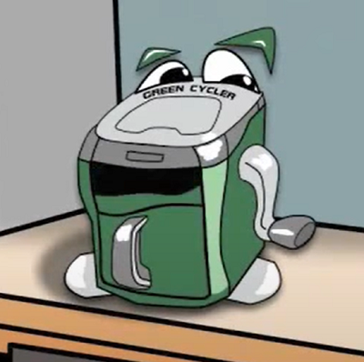
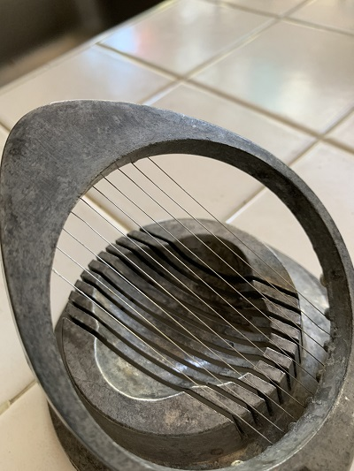
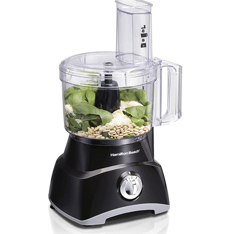
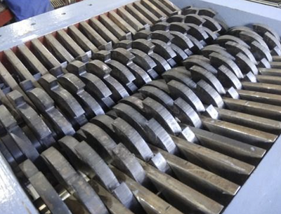
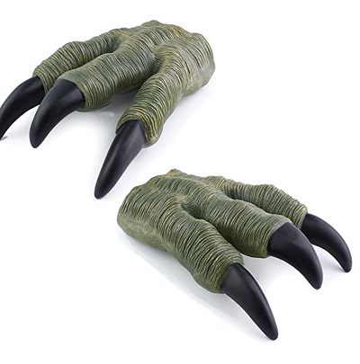
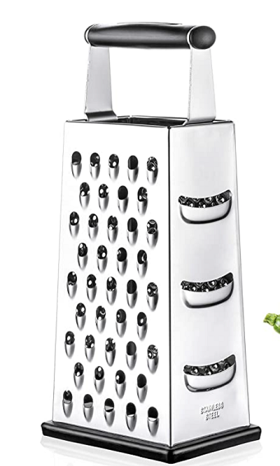

# Meet Chompy

Meet Chompy.  Chompy CRAVES food scraps and cardboard.  YUM YUM!!!!  Done with a meal but there are scraps?  Feed  Chompy.. got cardboard or paper you need to get rid of?  Feed   Chompy..and be delighted by the actions - from chomping noises while it turns scraps into small pieces...to sounds of delight as it enjoys the attention.  Chompy has a friend, Dacomp (not pictured here, but about the size and shape of a big garbage bin like we have in the US where we put our waste for weekly pickup), who survives by taking in Chompy’s broken down food scraps and spinning them into gold!  Well, not the gold we see in jewelry...and not even fools gold, but dark, rich soil that when you use it to grow plants, they will thrive.

 And of course, now that you have grown all these fruits and vegetables....you can eat them...which will leave food scraps....and so the cycle continues
# Requirements
E = Essential
NE = Non-Essential
In priority order

Needs to:
- E chop at least 80% of scraps of vegetables, fruits, cardboard, and paper into small pieces.
- E be safe - not cut or chop any fingers.
- E have a mechanism to start and stop shredding.
- E not jam.
- E take a short amount of time, i.e.: be efficient.
- E easy transfer of chopping to Dacomp.
- E not cause a mess.

- NE not smell.
- NE be easy to clean.
- NE have a mechanism to detect when the container is full and not allow any more food or paper to enter until the container is emptied.
- NE delight the person feeding it so that they want to engage.
- NE not take up too much space.
- NE chop up cardboard and paper into small pieces.

# Separate Out
## Chop up Vegetables and Fruits

### Mechanisms to accomplish
- Knives
This is my "go to" method for cutting up vegetables and fruit.  So why not use it here?
- Cleavers
When I think of using Cleavers I start laughing at the opportunity to make an arcade game out of it.  The handles of the cleavers are exposed on the sides of Chompy.  We madly slice as the cutting table moves a bit to keep the pieces accessible.  There are holes on the cutting table such that pieces small enough (and any liquid) fall through to the holding container.  How long it takes us to get the scraps into the container is judged based on the weight of the scraps (volume also, etc.?) and time. Every once and awhile, the holding container (Chompy's belly) burps, farts...hmm...

- Scissors
Forget running with scissors, imagine food scraps floating around and we
- Slicer

I just tried this slicer with an orange peel. I was able to get smaller pieces.  However,
- Food processor

I've been using a food processor to break down my veg/fruit waste prior to putting them into a compost bin.  This method is efficient - both from the time it takes and the bits it produces.  However, it is a bit of a pain:
- putting the scraps in - the container is not designed to slop in food waste.  
- the lid gets more difficult to close after scraping out the pieces to take to the compost pile.
- it takes multiple times to get through my daily scraps.
- I'm constantly cleaning the food processor.  Which perhaps for some is therapeutic, but not for me.

- Shredder

This would work great.  My challenge is all those blades and the "precision" positioning make me think building it this way would be challenging and ultimately expensive.  With that said, I am leaping to conclusions on challenge and price since a shredder can be built to shred pretty much anything...concrete may be an exception.

- Claws

I could see using claws to be a lot of fun.  Growling while we tore orange peels, apple cores, and stray lettuce dripping with salad dressing into shreds.  Yet, as I pretend to do this, I feel my claws as pictured wouldn't be able to attach well to things like orange peels and everything would just stick.

- Grater

I can imagine a grate tearing scraps to bits by abrasively rubbing against it, but I'm not a fan because using some sort of blade seems far more optimal.

- Garbage Disposal
Garbage disposals are designed to liquify food into a slurry that is then dumped into our sewage system.  We need small bits, not liquid.

## Start and Stop Mechanism
- on/off switch
- lever
- handle
