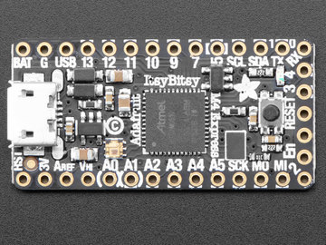
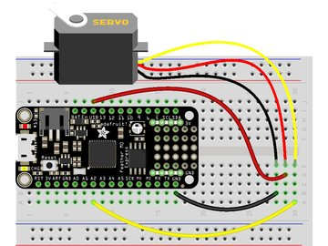
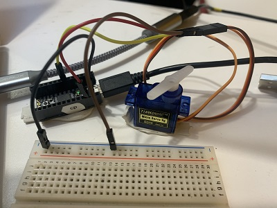
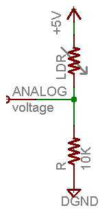
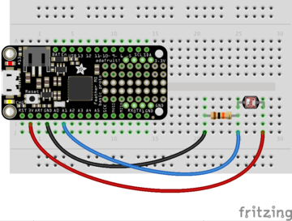
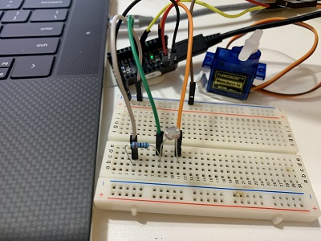
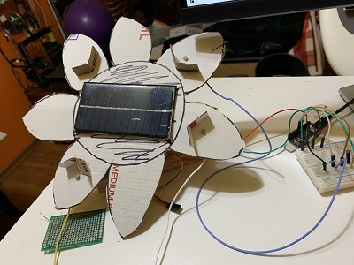
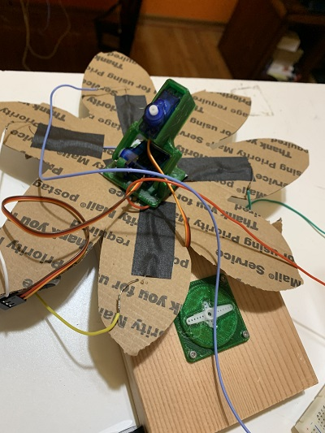
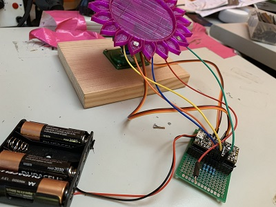

# You Are My Sunshine

Plants don't have feet.  Yet they move towards the sun.  WOW!

  


## The Art Behind the Sunshine
I am building Sunshine.  It is a plastic flower that uses photoresistors and servo motors to move its face towards the sun.

# Thanks to Those That Went Before
I am grateful for (and in awe of) the knowledge these folks shared:
- [Great Scott's YouTube Video: DIY Solar Tracker || How much solar energy can it save?](https://www.youtube.com/watch?v=_6QIutZfsFs)
- [fbuenonet's Thingiverse Mini Pan Tilt - Servo G9](https://www.thingiverse.com/thing:708819)
- [About Servos and Feedback](https://learn.adafruit.com/analog-feedback-servos?view=all)
- [What is a Servo Motor and How it Works?](https://www.youtube.com/watch?v=ditS0a28Sko) (Not sure why it's called a servo motor versus positioning motor?)
- [Happy Face Base on Thingiverse](https://www.thingiverse.com/thing:1381750)

I learned from and copied several of the techniques.

# Requirements
E = Essential
NE = Non-Essential
In priority order
- E Simplify the project such that it is completed within the 3 day timeframe.
- E Face moves easily.
- E On sunny days, the Flower (head) moves it's face to the sun (a location that points to the general location of the sun at that moment).
- E The face is in a noticeably different location by the end of the day.
- E The face fairly accurately traces the sun's angle on sunny days.
- E Powered by a battery so it can be outside.
    - stop/start when there is not enough light.
- E Create a time-lapse video **(Not sure about this?)**
    - GoPro, NEST cam, iPhone, GH5(?) (The ones Mark noted.  I have an iPhone...)
    - stop/start video when there is not enough light.
- E Eyes that move to where the Sun is located.  I probably won't get to this because of time constraints.  But given how story based this course is, having moving eyes would add a lot of personality.
- NE Solar panel recharges battery.  I mean, we're in the sun, go solar!
- NE Flower also has a stem that moves (gracefully) when the flower moves.  It is easiest to make just the head and have it move.  Mounting the head on a long stem and then adjusting the stem provides an "eye catcher".  However, the weight of the flower on the stem causes a challenge as does mimicking graceful movement.  With that said it is an opportunity to combine mechanical with electrical....

TL;DR Sadly, not enough time for putting a stem on.

# Questions
- Where should I place the photoresistors to maximize the effect of head movement? (Answer: Upper right, left and Lower right,left)
- What months should Sunshine be outside? (see below)

- Can I go directly from solar panel to powering the microcontroller or do I have to use a battery? (TBD)

## Months Sunshine Should be Outside
The best months have higher levels of solar radiation.  These are correlated to times when we are outside.
### Summary

Given my research on monthly Solar Radiation values in the Seattle area, Sunshine is to provide outdoor art goodness from April through September.  During this time, the average amount of solar radiation in the Seattle area is around 200  W/m<sup>2</sup>.
### More Info

I found a [University of Washington website](http://www.weatherjon.org/meteo/pages/station/climate.php?var=S) that provides average monthly solar radiation values for Seattle.  I downloaded as a csv file than used a [CSV to Markdown table generator](https://donatstudios.com/CsvToMarkdownTable) to get to the table below


| ""          | "Avg" | "Min" | "Max"  | "Range" | 
|-------------|-------|-------|--------|---------| 
| "January"   | "36"  | "0"   | "587"  | "587"   | 
| "February"  | "68"  | "0"   | "777"  | "777"   | 
| "March"     | "111" | "0"   | "1021" | "1021"  | 
| "April"     | "167" | "0"   | "1181" | "1181"  | 
| "May"       | "207" | "0"   | "1253" | "1253"  | 
| "June"      | "228" | "0"   | "1355" | "1355"  | 
| "July"      | "248" | "0"   | "1241" | "1241"  | 
| "August"    | "213" | "0"   | "1120" | "1120"  | 
| "September" | "150" | "0"   | "1132" | "1132"  | 
| "October"   | "82"  | "0"   | "970"  | "970"   | 
| "November"  | "43"  | "0"   | "709"  | "709"   | 
| "December"  | "29"  | "0"   | "480"  | "480"   | 

The values are in W/m<sup>2</sup>.

**Looking at the numbers, Sunshine will be doing its thing during the months of April through September.**

Averaging out these average values (167+207+228+248+213+150)/6 = 202 W/m<sup>2</sup>
# Explore / Familiarize
Here is where I'm documenting coding experiments to best understand aspects of the build electronics.
## The Microcontroller
I'm using an [ItsyBitsy from Adafruit](https://learn.adafruit.com/assets/55467) running [CircuitPython 6](https://circuitpython.org/).  


## Mark's Photoresistor + Servo Motor Experiment
Recreating to do a better job on my build and to recreate in CircuitPython.
### Servo Motor
Servo motors are used for precise (angular or linear) positioning.
- [Adafruit's Circuit Python Servo Motor Fritzing Diagram](https://learn.adafruit.com/assets/51929)



From [Adafruit's Learning Guide](https://learn.adafruit.com/circuitpython-essentials/circuitpython-servo):

*Connect the servo's brown or black ground wire to ground on the CircuitPython board.*

*Connect the servo's red power wire to 5V power, USB power is good for a servo or two. For more than that, you'll need an external battery pack. Do not use 3.3V for powering a servo!*

*Connect the servo's yellow or white signal wire to the control/data pin, in this case A1 or A2 but you can use any PWM-capable pin.*
## Test
Ran [Adafruit's code](https://github.com/adafruit/Adafruit_Learning_System_Guides/blob/master/CircuitPython_Essentials/CircuitPython_Servo.py) using the Mu editor. I used the USB pin for 5V power to servo and A2 for servo input.  Exactly what the learning guide said to do. 



**Worked great.**

### Photoresistor 
*Note...hmmm...I don't seem to have 10K resistors, so using a 2.2K voltage divider resistor.  I am ordering more from Amazon because 10K is popular...besides, less than a cup of fancy coffee.  Although I could put resistors in series/parallel..but this makes the bread board even messier, etc...*

As is typical, [Adafruit has a great write up on photoresistors](https://learn.adafruit.com/photocells):

*Photocells are basically a resistor that changes its resistive value (in ohms Ω) depending on how much light is shining onto the squiggly face. They are very low cost, easy to get in many sizes and specifications, but are very inaccurate. Each photocell sensor will act a little differently than the other, even if they are from the same batch. The variations can be really large, 50% or higher! For this reason, they shouldn't be used to try to determine precise light levels in lux or millicandela. Instead, you can expect to only be able to determine basic light changes.*

Since the photoresistor is just a variable resistor, wiring and reading values uses a voltage divider as shown in [Adafruit's Learn page](https://learn.adafruit.com/photocells/using-a-photocell):



*The easiest way to measure a resistive sensor is to connect one end to Power and the other to a pull-down resistor to ground. Then the point between the fixed pulldown resistor and the variable photocell resistor is connected to the analog input of a microcontroller*

[Adafruit's wiring diagram](https://learn.adafruit.com/assets/49000):




- Board 3.3V to one leg of the photocell (doesn't matter which leg).  Note you want to use the voltage from your board that corresponds to the maximum analog input voltage.  For Feather boards this is 3.3V, but for other boards it might be higher or lower--consult your board documentation to be sure.
- 10 kilo-ohm resistor to the other leg of the photocell.
- Board GND to the other leg of the 10 kilo-ohm resistor.
- Board A1 (or any other analog input) to the junction of the photocell & 10 kilo-ohm resistor.

Wired up.  The code here is simple and worked fine.  I just ran this in REPL:
```
import board
import analogio
photoresistor = analogio.AnalogIn(board.A3) 
photoresistor.value
```
e.g. values (voltage divider resistor = 22K):
- ambient: 36144
- hand over photoresistor: 22960
- iPhone light on photoresistor: 54592

values when voltage divider resistor = 2.2K:
- ambient: 10352
- hand over photoresistor: 4928
- iPhone light on photoresistor: 24624
**worked great**
### Photoresistor Controlling Servo


The wiring is set up, now it is just a matter of code:
```
# Move the servo based on photoresistor readings
# NOTE: I did not have 10K resistors.  I did have 22K resistors, so used tho

# Libraries used
import board
import analogio
import pwmio
import simpleio
from adafruit_motor import servo
import time

# Create a PWMOut object on Pin A2.
pwm = pwmio.PWMOut(board.A2, duty_cycle=2 ** 15, frequency=50)

# Create a servo object, my_servo.
my_servo = servo.Servo(pwm)

# Assign the photoresistor readout to Pin A3
photoresistor = analogio.AnalogIn(board.A3) 

# Let's have some fun!
while True:
    
    # Map the light reading to a server angle.
    # As noted in Learn.adafruit (photocells, circuitpython),the range of possible
    # resistor values is 0 to 65535 (max 16 bit unsigned integer).
    # The range of the servo arm is 0 to 180 degrees.
    angle = simpleio.map_range(photoresistor.value,0,65535,0,180) # get the light value and map it to a servo value
     
    # Move the servo to the mapped angle.
    
    my_servo.angle = angle
    time.sleep(0.05) # Adafruit sample does this so I do it too!
```
# Working Prototype
View from front:



View from back:



I placed four photoresists - one on each corner - of a cardboard "sunflower".  The internal circle holds a solar cell.  The solar cell is not necessary for this prototype.  However, I could see a good use in powering outdoor electronics so I'm seeing how the weight holds up.

The back view not only shows the wiring, but the use of [fbuenonet's Thingiverse Mini Pan Tilt - Servo G9](https://www.thingiverse.com/thing:708819).

## UHOH! NO PWM...
I started setting up a server motor on pin A1.  I got the message:
```
ValueError: All timers for this pin are in use
```
Running [Adafruit's "Where's my PWM?" code](https://learn.adafruit.com/circuitpython-essentials/circuitpython-pwm#wheres-my-pwm-2984449-30), I got the following results:
```
No PWM on: A0
No PWM on: A1
PWM on: A2
PWM on: A3
PWM on: A4
No PWM on: A5
PWM on: APA102_MOSI
PWM on: APA102_SCK
PWM on: D0
PWM on: D1
PWM on: D10
PWM on: D11
PWM on: D12
PWM on: D13
PWM on: D2
PWM on: D3
PWM on: D4
PWM on: D5
PWM on: D6
PWM on: D7
PWM on: D8
PWM on: D9
PWM on: L
PWM on: MISO
PWM on: MOSI
PWM on: RX
PWM on: SCK
PWM on: SCL
PWM on: SDA
PWM on: TX
```
No PWM support on A1 or A0 to D7 and D9
## Test - 4 Photoresistor on corners
The intent here is to get readings for the four corners.  All worked well except the lower right's high value was significantly lower ( ~20K versus ~50K) when shining a light directly at the photocell.  I checked the wiring which seemed ok.  

- use  a different photoresistor on Lower Right.
## Test - move servo motors
```
"""CircuitPython Essentials Servo standard servo example"""
import time
import board
import pwmio
from adafruit_motor import servo


pwm1 = pwmio.PWMOut(board.D9, duty_cycle=2 ** 15, frequency=50)
pwm2 = pwmio.PWMOut(board.D10, duty_cycle=2 ** 15, frequency=50)


my_servo1 = servo.Servo(pwm1)
my_servo2 = servo.Servo(pwm2)
```
# Final Build
## Summary
The [video where the flower chases the sun]() is the most interesting aspect.
## Components

- There were so many wires, I ended up soldering everything to a proto PCB board.  It was a bit of a bear on the soldering.  But I'm always up to a good soldering practice!  But it certainly made wire management MUCH easier
- Powered by 4 AA batteries.
- wires go to 2 servos and 4 photoresistors
- 3D printed sunflower (purple) and mini pan tilt (green)
- Circuit Python code - [chasingTheSun.py](code\chasingTheSun.py)

I am satisfied with what I have accomplished.  The sunflower works.


## MORE DETAIL I USED DURING PROJECT DEVELOPMENT.


## Color coding of flower wires
The Flower has four photoresistors at each "corner".  
| Position    | Wire Color | Analog Pin | 
|-------------|------------|------------| 
| Upper Left  | Blue       | A2         | 
| Upper Right | Orange     | A3         | 
| Lower Right | Yellow     | A4         | 
| Lower Left  | Green      | A5         | 

The red wire plugs into the 3V pin of the ItsyBitsy.
## Calibrating the Photoresistors
I was getting different readings under similar lighting conditions:
```
Upper left: 13408
Upper right: 7392
Lower right: 10912
Lower left: 10976
```
First I got average readings using [get_averages.py](code\get_averages.py)
### LOW Readings
I put a dark cloth over the photoresistors and took the average of 100 readings:
```
UL: 170.56, UR: 180.8, LR: 235.2, LL: 174.08
```
Three were close enough.  However, the LR was a tad higher.  This could be an artifact of how the wires stuck out of the dark cloth.  Due to time constraints, I'll press on with these values instead of exploring further.
### HIGH Readings
I put a flashlight directly on top of each photoresistor.
```
UL: 62144.3
UR = 61040.0
LR: 48747.8
LL: 60482.2
```
Again, it seemed LR was the "different" one.
## Testing Servo Motors
I ran [test_servos](code\test_servos.py) to make sure the servos worked.
I uploaded [a short video showing the servo motors doing their thing](https://youtu.be/2smJGX4DeHc)
## Move the Flower towards the sun
Now we're COOKING With SOLAR (well not really, we're using batteries that we throw away, but hey - this is all about the story...not about the Earth...hmmm...)
## Powering 
## Servo Motors
Both servo motors are powered by the 4 1.5 V batteries "wired" in series such that 4 x 1.5V = 6V.  
## ItsyBitsy
- plugged in: uses USB power
- not plugged in: Another load on the batteries.


***
# BELOW IS TBD...UNDER CONSTRUCTION
***


# Stuff that I find Interesting
Learnings that help me be a better Maker.
## How Much Energy Will the Solar Panel Provide?
I have [a small solar panel](https://amzn.to/2OGzq2h).  I am using this one instead of spending more time on research because of the project's time constraint.

The Amazon page notes:
- 5V
- 30mA
- 53x30mm

Usually, specifications are made during times when solar radiation is at its peak wherever these panels are manufactured.  *Maybe* we'll get close to these values in July...

If the panel works to these specifications:
```
P = IV
P = .03A * 5V = .15W
```
Our tiny solar cell won't have much solar harvesting, but if we're careful with how we use the battery, we'll  be able to extend battery recharging times.

## How much Power Do We Need
The:
- microcontroller
- servo motors
Need power to operate.  How much?
## Microcontroller Power consumption


# Battery
I have a [Samsung INR18650-25R battery](https://www.imrbatteries.com/content/samsung_25r_2.pdf) that I am not using.


